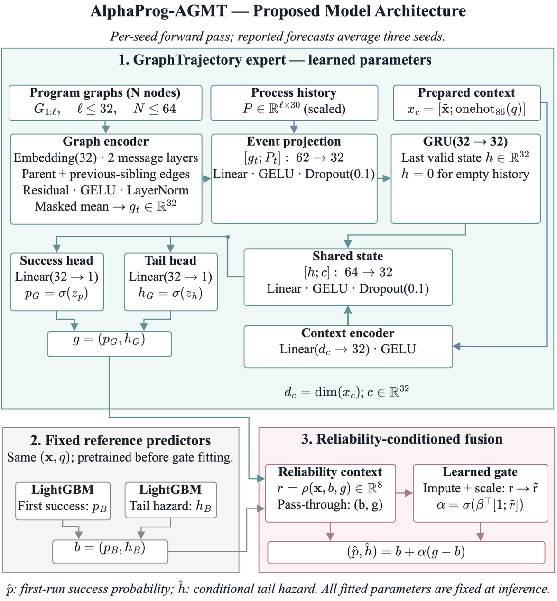

# GraphProg

**Graph and sequence models for programming trajectories, first-run success, and censored execution effort.**

GraphProg studies whether the structure and temporal order of previously observed programs improve predictions for a learner's first visit to a programming task. It provides seven executable notebooks, source data, saved experimental outputs, compact result tables, and numbered figures.

The implemented **AlphaProg-AGMT** combines a LightGBM reference model with a graph-and-GRU trajectory expert through an out-of-fold reliability gate. **GraphTrajectory** denotes the standalone trajectory expert. A separate school experiment predicts post-test computational-thinking scores from pre-test and contextual measurements; the two datasets are not linked at the individual level.

[Notebooks](notebooks/) · [Data](dataset/) · [Results](artifacts/) · [Figures](figures/)

## Datasets

GraphProg uses two independently collected, publicly released datasets. **RoboMission** is the primary source for predicting programming-task outcomes from prior program trajectories. The **school computational-thinking dataset** supports a separate regression experiment. Learners are not linked across sources, and the school experiment does not constitute external validation of the RoboMission model.

### RoboMission: programming events and trajectories

RoboMission is an introductory block-based programming environment. Its research data are documented in the original *Blockly Programming Dataset* resource by Effenberger [[1]](#data-ref-1). This repository uses the **2019-12-10 snapshot**, available from the [original archive](https://drive.google.com/file/d/1iKgMZFcKy5J1Ry9K7sUVeLAHK1fq-xJV/view). The [upstream data-description directory](https://github.com/adaptive-learning/adaptive-learning-research/tree/master/data/robomission-2019-02-09) is named `2019-02-09`; that directory name should not be confused with the snapshot used here.

| Source table | Records | Contents used in GraphProg |
| :--- | ---: | :--- |
| `events.csv` | 2,615,264 | Time-stamped program edits and executions, MiniCode representations, attempt identifiers, and execution correctness |
| `attempts.csv` | 164,707 | Learner–task attempts, start times, and observed activity summaries |
| `problems.csv` | 85 | Task identifiers and task descriptors |

The raw snapshot contains **11,675 distinct learner identifiers**, 2,050,253 editing events, and 565,011 execution events. MiniCode records provide the program structure from which command nodes, parent relations, and ordered sibling relations are constructed. These counts describe the included snapshot, not every release of RoboMission. The identifiers do not establish learners' ages, demographic composition, or classroom membership.

**Analytical cohort.** Notebook 01 sorts attempts chronologically and retains the first visit to each learner–task pair. Of 157,334 first visits, 2,232 have no observed execution and are excluded from the binary-outcome cohort. The resulting sample contains **155,102 first visits from 11,587 learner identifiers**. A missing execution is not encoded as an incorrect execution.

**Prediction targets and timing.** The primary target is correctness of the first observed execution, rather than eventual task completion. The secondary target is the number of executions until the first success; attempts with observed executions but no success are treated as right-censored at their last observed execution. Prediction takes place at the start of the new visit. Features use only events recorded strictly before that time, including already observed prefixes of earlier ongoing attempts. Final summaries or programs from the current attempt are not available as predictors. These definitions are implemented in notebooks 01–02.

### School data: computational-thinking scores and context

The second source is the dataset released by **El-Hamamsy, Bruno, Dehler Zufferey, and Mondada (2023)** on Zenodo, **version 1**, DOI [10.5281/zenodo.7489244](https://doi.org/10.5281/zenodo.7489244) [[2]](#data-ref-2). It documents student outcomes in a primary-school computer-science curricular reform in the Canton of Vaud, Switzerland; the associated study describes the collection context [[3]](#data-ref-3).

| Included source table | Raw rows | Role in this repository |
| :--- | ---: | :--- |
| `student_test_janjune_2021.csv` | 1,470 | January pre-test and June post-test scores; source of the regression cohort |
| `student_surveytest_nov_2021.csv` | 2,456 | Description of the later assessment and perception sample |
| `student_survey_may_2022.csv` | 1,644 | Description of the later perception sample |

The regression analysis uses **1,463 records with both pre-test and post-test scores**, excluding seven records without a complete score pair. The target is the June score on the competent Computational Thinking test (**cCTt**, 0–24 points). Available predictors comprise the January score, school grade, and 16 teacher-perception or motivation variables recorded before the outcome. Instruction counts collected after the post-test and score-change variables derived from that outcome are excluded. Missing contextual predictors are handled within the training pipeline; their absence does not automatically remove a learner with observed pre/post scores.

The November 2021 and May 2022 tables describe their respective source populations; they are not appended to the longitudinal training sample. Counts above refer to the released CSVs and GraphProg's stated eligibility rule. They should not be substituted for the analysis-specific sample sizes in the original study.

### Evaluation cohorts and separation

| Dataset | Split | Observations | Grouping units |
| :--- | :--- | ---: | :--- |
| RoboMission | Training | 108,877 | 8,075 learner identifiers |
| RoboMission | Validation | 23,326 | 1,750 learner identifiers |
| RoboMission | Test | 22,899 | 1,762 learner identifiers |
| School cCTt | Training | 909 | 4 schools |
| School cCTt | Validation | 157 | 1 school |
| School cCTt | Test | 397 | 2 schools |

RoboMission learners and school grouping units do not overlap across their respective splits. RoboMission development uses three learner-held-out folds; school model development uses leave-one-school-out validation within the four training schools. Imputation, scaling, encoding, and graph vocabularies are fitted within the relevant training partition. The school grouping and predictor definitions are recorded in notebook 01.

All 85 RoboMission tasks and overlapping calendar periods occur across splits. Consequently, the primary evaluation measures transfer to **held-out learner identifiers within a known task catalog**, not to unseen tasks or future years. The school test represents two held-out schools, which limits conclusions about population-wide transfer. Neither observational dataset by itself establishes a causal benefit of an adaptive teaching intervention.

### Availability and attribution

The necessary source files are included under [`dataset/`](dataset/README.md). The RoboMission archive is repacked to contain only the three required, byte-identical CSVs; other archive members are omitted. Notebook 01 extracts those files automatically, and notebooks 01–02 generate the derived cohorts and features. The school CSVs retain their original contents and the upstream **[CC BY 4.0](https://creativecommons.org/licenses/by/4.0/)** attribution. No new license is assigned to the RoboMission data. Original dataset references are provided below; this repository is a derived experimental implementation, not the original data release.

## Experimental results

The main comparison uses the same **22,899 held-out first-task visits from 1,762 learners**. Stochastic methods average probabilities across seeds 17, 42, and 2026. Lower LogLoss and Brier scores are better; higher AUROC and average precision are better.

| Model | LogLoss ↓ | AUROC ↑ | Average precision ↑ | Brier ↓ |
| :--- | ---: | ---: | ---: | ---: |
| GraphTrajectory | 0.52840 | 0.80507 | 0.74117 | 0.17795 |
| AlphaProg-AGMT | 0.52915 | 0.80469 | 0.74108 | 0.17820 |
| LightGBM | 0.53564 | 0.79955 | 0.73497 | 0.18051 |
| TabM | 0.53631 | 0.79867 | 0.73473 | 0.18079 |
| XGBoost | 0.53692 | 0.79882 | 0.73472 | 0.18089 |
| DKT | 0.54160 | 0.79473 | 0.73131 | 0.18265 |
| AKT | 0.54259 | 0.79349 | 0.72697 | 0.18312 |
| UKT | 0.54500 | 0.79094 | 0.72334 | 0.18430 |
| RandomForest | 0.54567 | 0.79373 | 0.72961 | 0.18395 |
| LogisticRegression | 0.55674 | 0.78039 | 0.70667 | 0.18832 |
| ItemMean | 0.59025 | 0.73948 | 0.63429 | 0.20277 |
| GlobalMean | 0.68410 | 0.50000 | 0.43286 | 0.24549 |

GraphTrajectory has the lowest observed episode-level LogLoss. AlphaProg-AGMT improves on the trained tabular and knowledge-tracing comparators, but its adaptive fusion does **not** establish an improvement over GraphTrajectory on the primary metric. The results concern these implementations and training budgets.

### Paired differences

Positive reductions favor AlphaProg-AGMT. Resampling retains complete learner trajectories; intervals are pointwise 95% intervals. Holm adjustment applies to the family of eleven paired zero-effect tests, not to simultaneous interval coverage.

| Comparator | LogLoss reduction | 95% learner-bootstrap interval | Holm-adjusted p |
| :--- | ---: | :---: | ---: |
| LightGBM | 0.00650 | [0.00536, 0.00758] | 0.00550 |
| TabM | 0.00716 | [0.00578, 0.00848] | 0.00550 |
| GraphTrajectory | -0.00074 | [-0.00193, 0.00049] | 0.22839 |

The predefined practical reference is a LogLoss reduction of 0.005. The sign-flip tests additionally assume symmetric learner-level effects under the null. See [paired effects](artifacts/06_paired_effects.csv) and [statistical comparisons](artifacts/07_statistical_tests.csv) for every comparator.

### Execution effort and the school task

AlphaProg-AGMT attains a joint first-success **NLL of 1.56754**, compared with 1.57781 for LightGBM and 1.57847 for TabM, each paired with the same separately trained hazard companion. The NLL reduction against LightGBM is 0.01027 with a pointwise 95% learner-bootstrap interval of [0.00858, 0.01213]. These are secondary outcomes with explicit censoring assumptions.

In the separate school test, **RidgePretest** achieves MAE 2.64810, RMSE 3.35857, and R² 0.50617 on 397 observations from two schools. This is a different target and population, not external validation of RoboMission predictions.

[Effort results](artifacts/07_effort.csv) · [Effort differences](artifacts/07_effort_effects.csv) · [School results](artifacts/07_school_quality.csv)

## Model

The trajectory expert encodes command nodes, parent relations, and ordered sibling relations in previously observed programs. Two message-passing steps produce program representations; a GRU summarizes up to 32 past attempt prefixes together with process variables and known task descriptors. Two output heads predict first-run success and the conditional success hazard after an initial failure.

For first-run success probability $p$ and subsequent-run hazard $q$,

$$P(T=1)=p,\qquad P(T=r)=(1-p)(1-q)^{r-2}q,\quad r\geq2.$$

Observed and right-censored attempts contribute to the likelihood. The auxiliary training loss is normalized by observed tail exposure. A regularized gate learns a common mixing weight for the two outputs from component OOF predictions; its hyperparameters are selected on validation. Across seeds, $p$ and $q$ are averaged before the geometric cumulative distribution is evaluated.



Ablations remove the graph encoder, temporal recurrence, auxiliary loss, regularization, or graph edges, and compare adaptive with constant fusion and the best single component. NoEdges preserves the active parameter count. NoOrder also changes model capacity, so its effect is not isolated to ordering alone. Ablation comparisons use seed 17, whereas the main results use three-seed averages. [Full ablation table](artifacts/07_ablations.csv).

## Run the notebooks

Use **Python 3.11** and a new virtual environment. The main package versions used for the saved experiment are pinned in `requirements.txt`.

```bash
git clone https://github.com/Guldek1987/GraphProg.git
cd GraphProg
python3.11 -m venv .venv
source .venv/bin/activate
python -m pip install -r requirements.txt
python -m ipykernel install --user --name graphprog --display-name "Python 3 (GraphProg)"
python -m jupyterlab
```

On Windows, activate the environment with `.venv\Scripts\activate`. LightGBM may require the OpenMP runtime on macOS (`brew install libomp`). Install **Times New Roman** through a licensed system font installation before regenerating figures. The font is not redistributed here. Tables retain the standard pandas/Jupyter appearance; Matplotlib figures use 18–20 pt text and 350 DPI.

Open the notebooks in numerical order and execute every code cell from top to bottom, starting a fresh kernel for each notebook. Notebook 01 unpacks only the three required RoboMission CSV files from the included archive. No Google Drive authentication or separate data download is required for the included snapshot.

| Notebook | Contents |
| :--- | :--- |
| [01 Data and research design](notebooks/01_Data_and_Research_Design.ipynb) | Source cohorts, measurement quality, grouped splits, temporal availability |
| [02 EDA and features](notebooks/02_EDA_and_Leakage_Safe_Features.ipynb) | MiniCode graphs, event-prefix features, distributions, Spearman, mutual information, XGBoost dependence |
| [03 Baselines](notebooks/03_Baseline_Models.ipynb) | Simple probabilities, logistic regression, random forest, XGBoost, LightGBM, school models |
| [04 Contemporary models](notebooks/04_Contemporary_Models.ipynb) | DKT, AKT, UKT, TabM, OOF predictions, seed/fold variation, residual structure |
| [05 Trajectory model and ablations](notebooks/05_Proposed_Model_and_Ablations.ipynb) | Graph/GRU implementation, censored loss, OOF fusion, sensitivity, ablations |
| [06 Model analysis](notebooks/06_Model_Analysis.ipynb) | Frozen test predictions, clustered uncertainty, calibration, subgroups, missing-history stress, errors, efficiency |
| [07 Results](notebooks/07_Results.ipynb) | Comparable final tables and diagnostic figures |

The full sequence retrains the models and can take several hours on a workstation. AKT uses CPU execution in the recorded experiment; other neural models use Apple MPS where available, with CPU support in the training code. Stored training and inference times describe the original execution, not a hardware-independent benchmark. The fit timings exclude cross-fitting and hyperparameter search.

Saved notebook outputs and the compact CSV tables can be inspected without retraining. Intermediate feature arrays, OOF probabilities, fitted checkpoints, and generated diagnostics are rebuilt locally and excluded from Git. Later notebooks therefore require the preceding computational stages; the repository does not replace model training with static-result display cells.

The pinned packages were installed in a separate Python 3.11 environment and their joint imports were verified. Saved numerical outputs come from the original experiment; full model retraining was not repeated for this release. Test results are already known. Frozen settings and source guards support reproduction of that evaluation; they do not turn subsequent experimentation into a new untouched test.

## Repository layout

```text
dataset/       source archive, school CSVs, data attribution, fixed evaluation settings
notebooks/     seven notebooks and pinned third-party model implementations
artifacts/     compact CSV result tables
figures/       23 numbered figures
requirements.txt
```

Execution creates `dataset/processed/`, `artifacts/runtime/`, and `figures/generated/`. Additional intermediate CSV/JSON files are generated by the notebooks and ignored by Git. The included snapshot contains no local environment, training-log dump, or serialized model bundle.

## Scope and limitations

- Outcomes are observational predictions conditional on the recorded choice of task. Improvements do not demonstrate a causal effect on learning or the utility of a recommendation policy.
- RoboMission ages are not documented; the project does not identify an Alpha-generation cohort.
- The geometric effort model assumes a constant conditional tail hazard. IPCW diagnostics rely on censoring assumptions that were not established experimentally.
- Learner-clustered uncertainty does not account for unknown shared classrooms. The school test contains only two independent schools.
- Architecture comparisons use bounded search spaces and different input representations. FA-KT and every other recent method are not claimed to have been reproduced.
- Peak RAM was not measured. CPU/MPS timings are reported for the original device choices; comparisons are not normalized by hardware.

## Implementations and references

- DKT: [Piech et al., 2015](https://arxiv.org/abs/1506.05908), recurrent interaction baseline implemented in notebook 04.
- AKT: [Ghosh et al., 2020](https://arxiv.org/abs/2007.12324).
- UKT: [Uncertainty-aware Knowledge Tracing](https://arxiv.org/abs/2501.05415).
- AKT/UKT source: [pyKT revision 77c3e90](https://github.com/pykt-team/pykt-toolkit/tree/77c3e90fdb807542194b989656ccac10e5d92e12), included under its MIT license. The UKT loader removes one unused relative utilities import; model operations are retained.
- TabM: [official implementation](https://github.com/yandex-research/tabm), version 0.0.3.

Third-party datasets and implementations retain their respective upstream terms and attribution. See [data sources](dataset/README.md) and [vendor notice](notebooks/_vendor/pykt/README.md).

## Data references

<a id="data-ref-1"></a>
**[1]** Effenberger, T. (2019). *Blockly Programming Dataset*. 3rd Educational Data Mining in Computer Science Education (CSEDM) Workshop. [Original dataset documentation and citation](https://github.com/adaptive-learning/adaptive-learning-research/blob/master/data/robomission-2019-02-09/README.md) · [2019-12-10 archive used here](https://drive.google.com/file/d/1iKgMZFcKy5J1Ry9K7sUVeLAHK1fq-xJV/view).

<a id="data-ref-2"></a>
**[2]** El-Hamamsy, L., Bruno, B., Dehler Zufferey, J., & Mondada, F. (2023). *Dataset for the evaluation of student-level outcomes of a primary school Computer Science curricular reform* (Version 1) [Data set]. Zenodo. [doi:10.5281/zenodo.7489244](https://doi.org/10.5281/zenodo.7489244).

<a id="data-ref-3"></a>
**[3]** El-Hamamsy, L., Bruno, B., Audrin, C., Chevalier, M., Avry, S., Dehler Zufferey, J., & Mondada, F. (2023). How are primary school computer science curricular reforms contributing to equity? Impact on student learning, perception of the discipline, and gender gaps. *International Journal of STEM Education, 10*, Article 60. [doi:10.1186/s40594-023-00438-3](https://doi.org/10.1186/s40594-023-00438-3).
